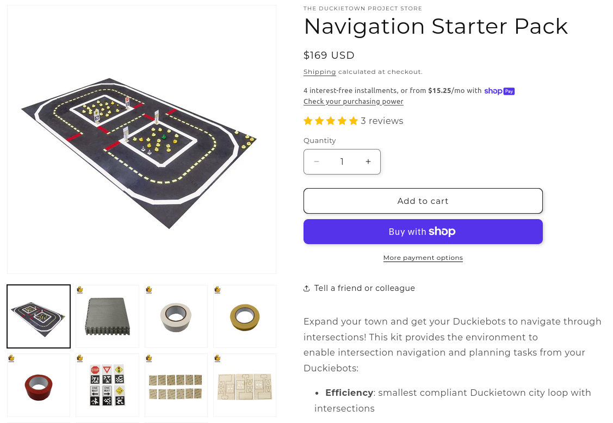
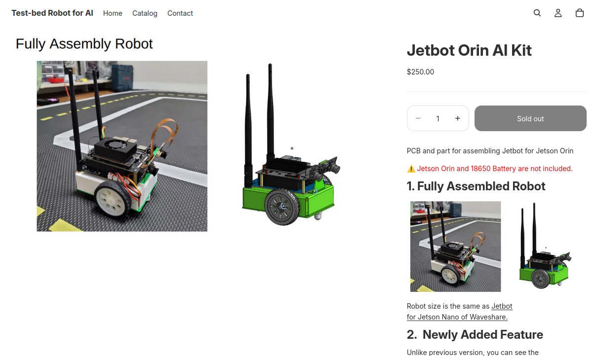
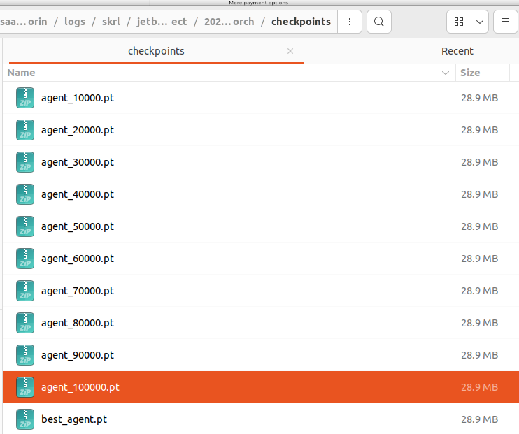
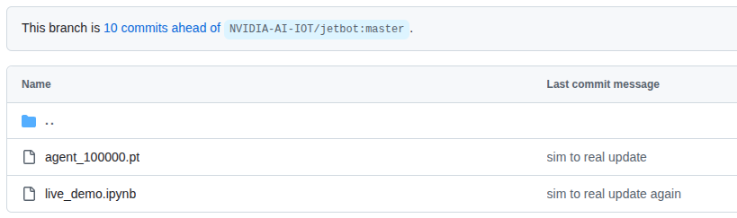
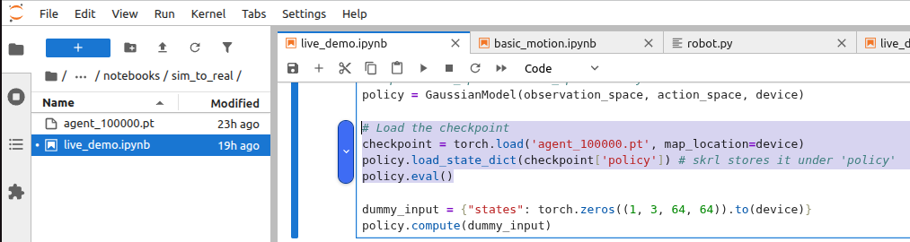

# Isaac Lab Duckietown Projects

## Overview


A project to train a vehicle-type robot to drive well in a duckietown environment using deep reinforcement learning.

## Installation

- Install Isaac Lab 4.5 version by following the [installation guide](https://isaac-sim.github.io/IsaacLab/main/source/setup/installation/index.html).

- Clone or copy this project/repository separately from the Isaac Lab installation (i.e. outside the `IsaacLab` directory):
  
  ```bash
      git clone https://github.com/kimbring2/isaac_lab_jetbot_orin.git
  ```

- Using a python interpreter that has Isaac Lab installed, install the library in editable mode using:
  
  ```bash
  python -m pip install -e source/isaac_lab_jetbot_orin
  ```

- Verify that the extension is correctly installed by:
  
  - Listing the available tasks:
    
    ```bash
    python scripts/list_envs.py
    ```
  
  - Running a training task:
    
    ```bash
    python scripts/skrl/train.py --task=Isaac-Lab-Jetbot-Orin-Direct-v0 --enable_cameras --num_envs 512 --video --headless
    ```
  
  - Running a playing task:
    
    ```bash
    python scripts/skrl/play.py --task=Isaac-Lab-Jetbot-Orin-Direct-v0 --num_envs 1 --enable_cameras
    ```

  - You can download [the best pretrained model](https://drive.google.com/file/d/1_miASXXn9zV9eGi__JZVAhy3ieRXKYJF/view?usp=sharing).

## Sim to Real

After training Jetbot in a virtual space, you will need to check whether it behaves well in the real world. The list of materials for that experiment is as follows.

- Track: You can buy the track of the simulator from [Navigation Starter Pack](https://get.duckietown.com/products/duckietown-navigation-starter-pack?srsltid=AfmBOooxVkau2kOaG1PVr42yN5sW3LXgE4aZnoAO3JZxI6DdPAChaQrD).
  
  

- Robot: You can buy the robot simulator from [Jetbot Orin AI Kit](https://test-bed-robot-for-ai.myshopify.com/products/jetbot-orin?variant=53153578844525).
  
  

- Copying checkpoint: After setting up the real Jetbot through [this repository](https://github.com/kimbring2/jetbot/tree/jetbot-orin), please copy the trained weight of IssacLab to that.
  
  
  
  
  
  Please open and test the copied weight through [live_demo.ipynb](https://github.com/kimbring2/jetbot/blob/jetbot-orin/notebooks/sim_to_real/live_demo.ipynb "live_demo.ipynb") Notebook.
  
  


- Current testing result: It is not perfect, but it tends to move as learned in the simulation.
  
  
